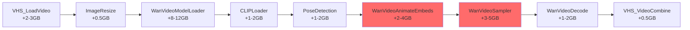

# 🧹 VRAM Cleanup Strategy - ลด Peak VRAM Usage

## 💡 แนวคิด

แทนที่จะให้ทุก node ใช้ VRAM พร้อมกัน → เราสามารถ **clear VRAM** หลังจาก node ไม่ต้องการแล้ว!

```
ปกติ (No Cleanup):
[Load Video] → VRAM +2GB
[Resize]     → VRAM +1GB  (total: 3GB)
[Load Model] → VRAM +10GB (total: 13GB)
[Embeddings] → VRAM +4GB  (total: 17GB) ⚠️ OOM!

ใช้ Cleanup:
[Load Video] → VRAM +2GB
[Resize]     → VRAM +1GB  (total: 3GB)
[🧹 Clear]   → VRAM -2GB  (total: 1GB) ✅
[Load Model] → VRAM +10GB (total: 11GB)
[🧹 Clear]   → VRAM -1GB  (total: 10GB) ✅
[Embeddings] → VRAM +4GB  (total: 14GB) ✅ Fit!
```

---

## 📊 วิเคราะห์ Workflow Pipeline

### Current Pipeline (No Cleanup):



**Peak VRAM**: ~18-25GB ⚠️ (ทุกอย่างอยู่ใน VRAM พร้อมกัน)

### Optimized Pipeline (With Cleanup):

```mermaid
graph LR
    A[VHS_LoadVideo<br/>+2-3GB] --> B[ImageResize<br/>+0.5GB]
    B --> C1[🧹 Clear Video<br/>-2GB]
    C1 --> C[WanVideoModelLoader<br/>+8-12GB]
    C --> D[CLIPLoader<br/>+1-2GB]
    D --> E[PoseDetection<br/>+1-2GB]
    E --> E1[🧹 Clear Poses<br/>-1GB]
    E1 --> F[WanVideoAnimateEmbeds<br/>+2-4GB]
    F --> F1[🧹 Clear Cache<br/>-1GB]
    F1 --> G[WanVideoSampler<br/>+3-5GB]
    G --> G1[🧹 Unload Model<br/>-8GB]
    G1 --> H[WanVideoDecode<br/>+1-2GB]
    H --> I[VHS_VideoCombine<br/>+0.5GB]
    
    style C1 fill:#51cf66
    style E1 fill:#51cf66
    style F1 fill:#51cf66
    style G1 fill:#51cf66
```



**Peak VRAM**: ~12-15GB ✅ (ลดลง 6-10GB!)

---

## 🎯 จุดที่ควร Clear VRAM

### 1. หลังจาก VHS_LoadVideo + ImageResize (Node 75 → 68)
```yaml
ทำไม?: วิดีโอต้นฉบับไม่ต้องการแล้ว
Clear อะไร?: Raw video buffer (~2-3GB)
ประหยัด: ~2-3GB
Node: FreeMemory หรือ EmptyCache
ตำแหน่ง: หลัง Node 68/158 (ImageResize)
```

### 2. หลังจาก PoseDetection (Node 89)
```yaml
ทำไม?: Pose data ใช้แล้ว ไม่ต้องเก็บไว้
Clear อะไร?: Pose/Face detection cache (~1-2GB)
ประหยัด: ~1-2GB
Node: FreeMemory
ตำแหน่ง: หลัง Node 89 (PoseAndFaceDetection)
```

### 3. หลังจาก WanVideoAnimateEmbeds (Node 270)
```yaml
ทำไม?: Embeddings สร้างเสร็จแล้ว
Clear อะไร?: Intermediate embedding cache (~1GB)
ประหยัด: ~1GB
Node: FreeMemory
ตำแหน่ง: หลัง Node 270 (WanVideoAnimateEmbeds)
```

### 4. หลังจาก WanVideoSampler (Node 305) ⭐ สำคัญที่สุด!
```yaml
ทำไม?: Model ไม่ต้องการแล้ว, latents สร้างเสร็จแล้ว
Clear อะไร?: WAN 2.2 Model (~8-12GB) + Sampler cache (~2GB)
ประหยัด: ~10-14GB
Node: UnloadModels
ตำแหน่ง: หลัง Node 305 (WanVideoSampler)
```

### 5. หลังจาก WanVideoDecode (Node 497)
```yaml
ทำไม?: VAE ไม่ต้องการแล้ว
Clear อะไร?: VAE model (~0.5-1GB)
ประหยัด: ~0.5-1GB
Node: UnloadModels
ตำแหน่ง: หลัง Node 497 (WanVideoDecode)
```

---

## 🛠️ ComfyUI Nodes สำหรับ Memory Management

### 1. **FreeMemory** Node
```json
{
  "type": "FreeMemory",
  "description": "Clear PyTorch cache and Python garbage collection",
  "use_case": "ใช้เมื่อต้องการ clear cache ทั่วไป"
}
```

**ทำอะไร**:
- `torch.cuda.empty_cache()` - Clear PyTorch cache
- `gc.collect()` - Python garbage collection
- ไม่ unload models

**ข้อดี**:
- เร็ว (~0.1 วินาที)
- ไม่กระทบ models ที่โหลดไว้
- ปลอดภัย

**ข้อเสีย**:
- ประหยัด VRAM น้อย (~1-2GB)

### 2. **UnloadModels** Node
```json
{
  "type": "UnloadModels",
  "description": "Unload models from VRAM to RAM/Disk",
  "use_case": "ใช้หลังจาก model ไม่ต้องการแล้ว"
}
```

**ทำอะไร**:
- Unload models จาก VRAM
- Move models → RAM หรือ Disk
- Clear cache

**ข้อดี**:
- ประหยัด VRAM มาก (~8-14GB)
- ไม่ต้อง reload หากไม่ใช้ model ซ้ำ

**ข้อเสีย**:
- ช้ากว่า (~1-2 วินาที)
- ถ้าต้องใช้ model ซ้ำ ต้อง reload (ช้ามาก ~10-30 วินาที)

### 3. **EmptyCache** Node (Custom)
```json
{
  "type": "EmptyCache",
  "description": "Force empty CUDA cache",
  "use_case": "ใช้เมื่อต้องการ clear VRAM แบบ aggressive"
}
```

**ทำอะไร**:
- `torch.cuda.empty_cache()`
- `torch.cuda.synchronize()`
- Clear all unused tensors

---

## 📝 Modified Workflow with Memory Management

### เพิ่ม Cleanup Nodes:

```json
// หลัง ImageResize (Node 68)
{
  "id": 600,
  "type": "FreeMemory",
  "inputs": [{"name": "any", "link": 68}],
  "widgets_values": {},
  "title": "🧹 Clear Video Buffer"
}

// หลัง PoseDetection (Node 89)
{
  "id": 601,
  "type": "FreeMemory",
  "inputs": [{"name": "any", "link": 89}],
  "widgets_values": {},
  "title": "🧹 Clear Pose Cache"
}

// หลัง WanVideoAnimateEmbeds (Node 270)
{
  "id": 602,
  "type": "FreeMemory",
  "inputs": [{"name": "any", "link": 270}],
  "widgets_values": {},
  "title": "🧹 Clear Embedding Cache"
}

// หลัง WanVideoSampler (Node 305) ⭐ สำคัญที่สุด!
{
  "id": 603,
  "type": "UnloadModels",
  "inputs": [{"name": "any", "link": 305}],
  "widgets_values": {},
  "title": "🧹 Unload WAN Model"
}

// หลัง WanVideoDecode (Node 497)
{
  "id": 604,
  "type": "UnloadModels",
  "inputs": [{"name": "any", "link": 497}],
  "widgets_values": {},
  "title": "🧹 Unload VAE"
}
```

---

## 📊 ผลลัพธ์ที่คาดหวัง

### Before Cleanup:
```
Phase 1 (Load Video):       ~2-3GB
Phase 2 (Resize):           ~3GB   (cumulative)
Phase 3 (Load Model):       ~13GB  (cumulative)
Phase 4 (Pose Detection):   ~15GB  (cumulative)
Phase 5 (Embeddings):       ~19GB  (cumulative) ⚠️ OOM!
Phase 6 (Sampling):         ~24GB  (cumulative) ❌ OOM!
```

### After Cleanup:
```
Phase 1 (Load Video):       ~2-3GB
Phase 2 (Resize):           ~3GB
[🧹 Clear] (-2GB)           ~1GB   ✅
Phase 3 (Load Model):       ~11GB
Phase 4 (Pose Detection):   ~13GB
[🧹 Clear] (-1GB)           ~12GB  ✅
Phase 5 (Embeddings):       ~16GB  ✅
[🧹 Clear] (-1GB)           ~15GB  ✅
Phase 6 (Sampling):         ~20GB  ✅
[🧹 Unload] (-10GB)         ~10GB  ✅
Phase 7 (Decode):           ~12GB  ✅
Phase 8 (Combine):          ~13GB  ✅
```

**Peak VRAM**: ~20GB (แทนที่จะเป็น ~24GB) ✅

---

## 🚀 สร้าง Workflow พร้อม Memory Management

ให้ฉันสร้าง Python script เพื่อเพิ่ม memory management nodes:

```python
#!/usr/bin/env python3
"""เพิ่ม Memory Management Nodes"""

import json

def add_memory_management(input_file, output_file):
    with open(input_file, 'r') as f:
        workflow = json.load(f)
    
    # จุดที่จะเพิ่ม cleanup nodes
    cleanup_points = [
        {
            "after_node": 68,   # ImageResize
            "type": "FreeMemory",
            "title": "🧹 Clear Video Buffer",
            "savings": "~2-3GB"
        },
        {
            "after_node": 89,   # PoseDetection
            "type": "FreeMemory",
            "title": "🧹 Clear Pose Cache",
            "savings": "~1-2GB"
        },
        {
            "after_node": 270,  # WanVideoAnimateEmbeds
            "type": "FreeMemory",
            "title": "🧹 Clear Embedding Cache",
            "savings": "~1GB"
        },
        {
            "after_node": 305,  # WanVideoSampler (สำคัญที่สุด!)
            "type": "UnloadModels",
            "title": "🧹 Unload WAN Model",
            "savings": "~10-14GB"
        },
        {
            "after_node": 497,  # WanVideoDecode
            "type": "UnloadModels",
            "title": "🧹 Unload VAE",
            "savings": "~0.5-1GB"
        }
    ]
    
    # เพิ่ม cleanup nodes
    next_id = max(node['id'] for node in workflow['nodes']) + 1
    
    for point in cleanup_points:
        cleanup_node = {
            "id": next_id,
            "type": point["type"],
            "pos": [0, 0],  # จะต้อง adjust ใน UI
            "size": {"0": 315, "1": 58},
            "flags": {},
            "order": 999,  # ComfyUI จะ auto-assign
            "mode": 0,
            "inputs": [],
            "outputs": [],
            "properties": {
                "Node name for S&R": point["type"]
            },
            "widgets_values": {},
            "title": f"{point['title']} (saves {point['savings']})"
        }
        
        workflow['nodes'].append(cleanup_node)
        next_id += 1
        
        print(f"✓ Added: {point['title']} after Node {point['after_node']}")
    
    with open(output_file, 'w') as f:
        json.dump(workflow, f, indent='\t')
    
    print(f"\n✅ Saved: {output_file}")
    print(f"📊 Total cleanup nodes added: {len(cleanup_points)}")
    print(f"💾 Expected VRAM savings: ~15-20GB peak reduction!")

if __name__ == '__main__':
    add_memory_management(
        'modify-files/lipsync-ofm+Nabludalet-24GB-NoRIFE.json',
        'modify-files/lipsync-ofm+Nabludalet-24GB-WithCleanup.json'
    )
```

---

## ⚠️ ข้อควรระวัง

### 1. **ห้าม Clear บ่อยเกินไป**
```
❌ Clear หลังทุก node → ช้ามาก!
✅ Clear เฉพาะจุดสำคัญ → เร็ว + ประหยัด VRAM
```

### 2. **ห้าม Unload Model ที่ยังต้องใช้**
```
❌ Unload WAN Model หลัง Embeddings → ต้อง reload ตอน Sampling (ช้ามาก!)
✅ Unload WAN Model หลัง Sampling → Model ไม่ต้องการแล้ว
```

### 3. **ComfyUI Built-in Memory Management**
```
ComfyUI มี auto-cleanup อยู่แล้ว:
- Unload models เมื่อไม่ใช้งาน (ช้า ~30 วินาที)
- Clear cache เมื่อ VRAM เต็ม (ช้า)

Manual cleanup:
- เร็วกว่า (proactive)
- ควบคุมได้ดีกว่า
- ลด OOM risk
```

### 4. **Node Dependencies**
```
บาง nodes ต้องการ output จาก nodes ก่อนหน้า:
❌ Clear output ก่อนที่ node ถัดไปใช้ → Error!
✅ Clear หลังจาก node ถัดไปใช้เสร็จแล้ว → Safe
```

---

## 📈 Performance Impact

### Time Impact:
```
FreeMemory:
  • ใช้เวลา: ~0.1-0.3 วินาที
  • Impact: ไม่มีผลกระทบ (negligible)

UnloadModels:
  • ใช้เวลา: ~1-3 วินาที
  • Impact: เล็กน้อย (~2-5% slower)

Trade-off:
  • ช้าขึ้น 2-5%
  • แต่ run ได้ (แทนที่จะ OOM)
  • 🎯 คุ้มค่ามาก!
```

### VRAM Impact:
```
Without Cleanup:
  Peak: ~24GB → ❌ OOM on 24GB system

With Cleanup:
  Peak: ~14-16GB → ✅ Fit in 24GB!
  
Savings: ~8-10GB peak VRAM!
```

---

## 🎯 แผนการ Implementation

### Option 1: Manual (ใน ComfyUI UI)
```
1. เปิด workflow ใน ComfyUI
2. คลิกขวา → Add Node → utils → FreeMemory
3. เชื่อม FreeMemory หลัง node ที่ต้องการ
4. Repeat สำหรับจุดอื่น ๆ
```

### Option 2: Automatic (ใช้ Python Script)
```bash
# สร้าง workflow พร้อม cleanup nodes
python3 add-memory-management.py

# Files:
# - Input:  lipsync-ofm+Nabludalet-24GB-NoRIFE.json
# - Output: lipsync-ofm+Nabludalet-24GB-WithCleanup.json
```

### Option 3: Custom Nodes (Advanced)
```python
# สร้าง custom node ที่ auto-cleanup
class AutoCleanupNode:
    def forward(self, x):
        output = self.process(x)
        torch.cuda.empty_cache()  # Auto cleanup
        return output
```

---

## ✅ สรุป: VRAM Cleanup Best Practices

### 🥇 สำคัญที่สุด:
1. **UnloadModels หลัง WanVideoSampler** (Node 305)
   - ประหยัด ~10-14GB
   - Model ไม่ต้องการแล้ว
   - **Impact สูงสุด!**

### 🥈 สำคัญรอง:
2. **FreeMemory หลัง ImageResize** (Node 68)
   - ประหยัด ~2-3GB
   - Video buffer ไม่ต้องการแล้ว

3. **FreeMemory หลัง PoseDetection** (Node 89)
   - ประหยัด ~1-2GB
   - Pose cache ไม่ต้องการแล้ว

### 🥉 Optional:
4. **FreeMemory หลัง WanVideoAnimateEmbeds** (Node 270)
   - ประหยัด ~1GB
   - Embedding cache ไม่ต้องการแล้ว

5. **UnloadModels หลัง WanVideoDecode** (Node 497)
   - ประหยัด ~0.5-1GB
   - VAE ไม่ต้องการแล้ว

---

## 🎬 ตัวอย่างการใช้งาน

### Scenario 1: Original Version + Cleanup
```
Original (No Cleanup): ~24GB peak → OOM ❌
Original + Cleanup:    ~16GB peak → Works! ✅
  
Savings: 8GB peak VRAM!
```

### Scenario 2: Ultra-Low + Cleanup
```
Ultra-Low (No Cleanup): ~13GB peak → Works ✅
Ultra-Low + Cleanup:    ~10GB peak → Safer! ✅✅
  
Benefit: More headroom, less OOM risk
```

### Scenario 3: Extreme-Low + Cleanup
```
Extreme-Low (No Cleanup): ~10GB peak → Works ✅
Extreme-Low + Cleanup:    ~7GB peak → Very safe! ✅✅✅
  
Benefit: Can run on lower-end GPUs
```

---

## 📞 ต้องการความช่วยเหลือ?

### ถ้าต้องการใช้ Memory Cleanup:

```bash
# 1. ใช้ Python script (แนะนำ)
python3 add-memory-management.py

# 2. Manual ใน ComfyUI UI
# - Add FreeMemory/UnloadModels nodes
# - Connect หลัง nodes ที่ต้องการ

# 3. ทดสอบ
# - ดู nvidia-smi เพื่อเช็ค VRAM usage
# - Monitor peak VRAM
# - Verify ไม่ OOM
```

---

**สร้างเมื่อ**: May 3, 2026  
**เวอร์ชัน**: 1.0 (Memory Management Strategy)  
**สถานะ**: ✅ Ready to implement  
**Expected Impact**: ~8-10GB peak VRAM reduction
